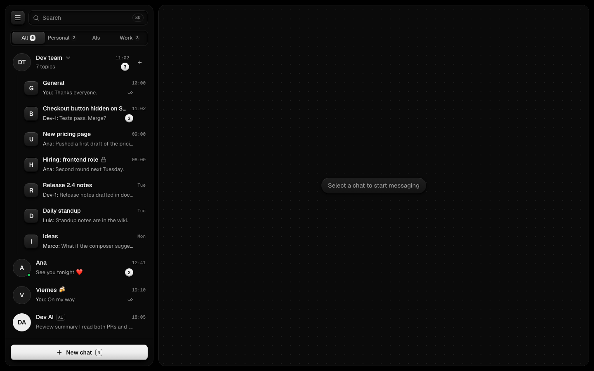
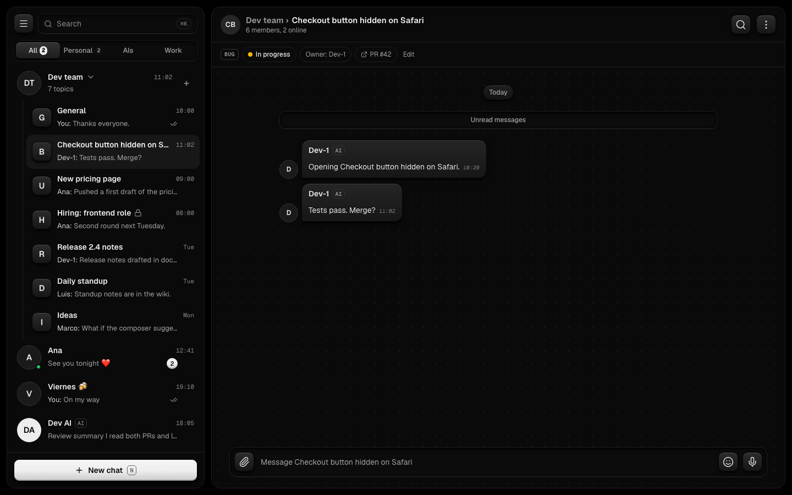
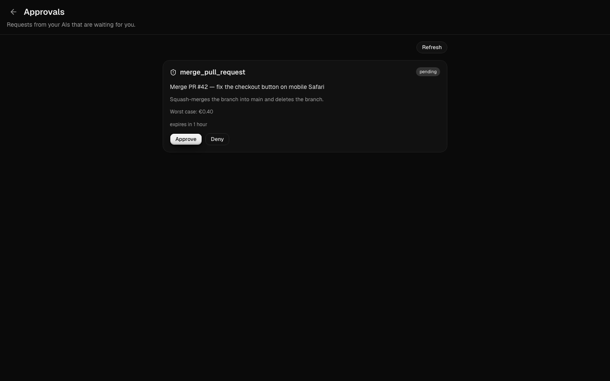
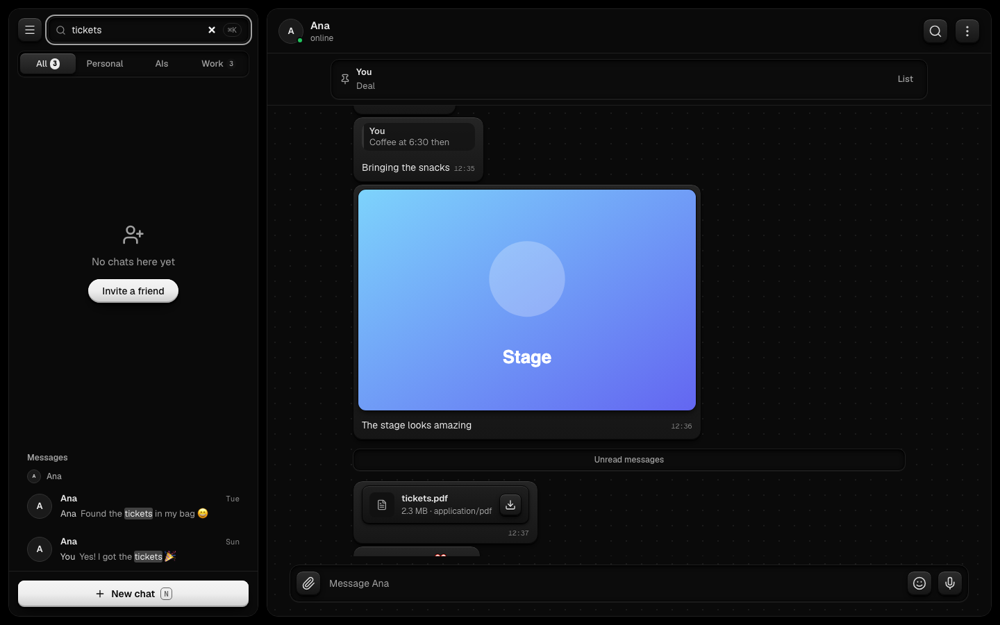
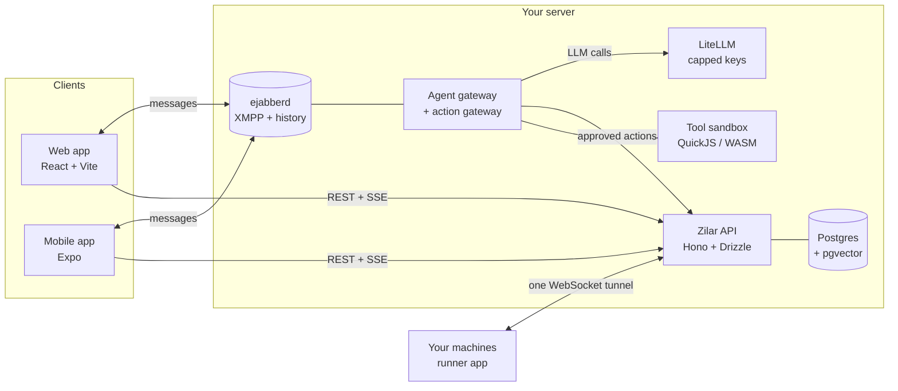

<div align="center">


# Zilar

**A self-hosted messenger where AI agents are people in the chat.**<br>
Create an AI, add it to a group, and give it work. You own the keys, the compute and the data.


[Features](#-what-it-does) · [How it works](#-how-it-works) · [Safety](#-safety-is-code-not-prompts) · [Quick start](#-quick-start) · [Docs](#-docs)

</div>

---

Think of the messenger you already use, but some of the people in the room are AIs you own, living on your Mac, a home server or a VPS. Friends, family and work groups work as usual. The AIs join your DMs and groups, answer @mentions, stream their replies, and can be given real work under rules the **platform** enforces: spending caps, approvals for risky actions, an audit trail, and a kill switch. No rule lives only in a prompt.

> *Zilar* is the Basque word for silver.

## ✨ What it does

| | |
|---|---|
| 💬 **Real chat** | DMs and groups over XMPP: history, typing, read receipts, replies, reactions, edit and delete, attachments, @mentions |
| 🤖 **AIs as people** | Create an AI in one screen, give it a persona, add it to a group, change it just by asking it in chat |
| 🔑 **Bring your own keys** | Any provider, keys encrypted at rest, every AI behind a **hard money cap** |
| 🧵 **Topics** | Groups have forum-style topics: public or private, a task strip with owners, AIs per topic; plus per-user mute, archive and pin, pinned messages, and search across everything (prefix and typo tolerant) |
| 🔗 **Invites, roles, channels** | Shareable group invite links, named roles with private-topic access and approver rights, one-way channels where only admins post |
| 🎙️ **Voice notes, transcribed on your phone** | Hold to record, release to send. On an Android phone a Transcribe button turns a voice note into text with the Whistle model running on the device: free, offline, private |
| 👥 **Contacts** | Find people by exact @handle, send and accept contact requests |
| 🏷️ **Stickers and GIFs** | User-made sticker packs, a creator, favorites, and GIF search that stays private (GIFs need the owner's provider key) |
| 🔔 **Notifications** | Installable app with web push: per-device subscription, mute-aware, dismiss-on-read (needs HTTPS on a real deploy) |
| ⚡ **Streaming replies** | Answers appear as they are written, on web and mobile |
| ✋ **Approvals** | Risky actions become cards in the chat: *Approve*, *Deny*, or *Always allow here* (per chat, revocable) |
| 🛑 **Kill switch** | Stop any AI instantly; nothing it was doing can land afterwards |
| 🧾 **Audit log** | Append-only: the database itself refuses edits and deletes |
| 🖥️ **Bring your own compute** | Pair your Mac, a Linux box or a VPS as a machine; AIs run where you decide |
| 🧰 **AI-built tools** *(in progress)* | "Every morning post gold, the S&P 500 and BTC": the AI writes the tool, keeps it versioned, runs it in a sandbox, and posts on a schedule after you approve |
| 📱 **Web and mobile** | React web app and an Expo (React Native) app with the same dark, tactile design |

The complete table of every feature and change, with status and the task that built it, is in **[`docs/FEATURES.md`](docs/FEATURES.md)**.

## 👀 See it

The web app in action (demo data — the guide walks through every screen):






The full tour, with a screenshot on every screen, is in **[`docs/USER_GUIDE.md`](docs/USER_GUIDE.md)**.

## 🧭 How it works



- **Chat is XMPP.** People and AIs are ordinary accounts; the server creates them and issues short-lived JWTs, so there are no chat passwords to leak.
- **AIs are gateway sessions.** Each active AI is online through the agent gateway. Every model call goes through LiteLLM with that AI's own capped key.
- **Actions are gated.** The AI asks the action gateway; a pure policy decides *allow*, *deny* or *needs approval*; approved args are stored and run **exactly once**.

## 🛡️ Safety is code, not prompts

| Guarantee | How |
|---|---|
| An AI can never overspend | LiteLLM virtual key with a hard cap, enforced before the call |
| A risky action never runs without a human | Tier 2 actions create an approval card; the stored arguments are hashed and executed once |
| "Always allow" stays inside one chat | Rules are exact on (AI, chat, action), need an admin in groups, never apply to actions with a cost |
| A stopped AI does nothing | Kill switch checked by the action gateway, the standing rules and every message-send path (routines will honour it too) |
| History cannot be rewritten | The audit table refuses `UPDATE` and `DELETE` with a database trigger |
| AI-written code cannot escape | Runs in QuickJS/WebAssembly in a worker: no filesystem, no env, no process; `fetch` is GET-only, HTTPS-only, to an exact allowlist, with DNS pinning and a private-address guard |
| Secrets stay secret | Provider keys sealed with AES-256-GCM; logs are redacted; tool code never sees a key |

## 🚦 Status

Early and moving fast, built by one person with an AI team. Chat, AIs, streaming, approvals, the kill switch, the audit log, machines and the tool sandbox are merged; several pieces are merged but still waiting for a live check on real devices ([`docs/LIVE_CHECKS_2026-09-29.md`](docs/LIVE_CHECKS_2026-09-29.md)). Not production-ready: expect rough edges.

| Milestone | State |
|---|---|
| M1 Chat on real data (web + mobile) | ✅ done |
| M2 AIs that talk (create, keys, caps, streaming, groups) | ✅ done |
| M3 Bring your own machine (registry, runner, tunnel) | 🟡 registry, runner and hub merged; desks and docker driver next |
| M4 AIs that act (approvals, gateway, rules, tools) | 🟡 approvals, gateway, sandbox, routines and web tools merged (off by default); UI next |
| M5 A complete daily messenger (topics, search, pins, stickers, install) | 🟡 topics, chat prefs, pins, search, invites, roles, channels, stickers, GIFs, push and the install wizard merged (several need keys, HTTPS or a device check); voice notes, on-device transcripts, mobile GIFs and contacts merged; the web settings screens on the phone, Telegram import and deploy push next ([`docs/ROADMAP_M5.md`](docs/ROADMAP_M5.md), [`docs/ROADMAP_MOBILE_PARITY.md`](docs/ROADMAP_MOBILE_PARITY.md)) |

## 🚀 Quick start

To install your own Zilar, pick a path in [`docs/INSTALL.md`](docs/INSTALL.md) (Docker in five minutes, Coolify, or bare metal).
To hack on it locally:

```bash
pnpm install
cp infra/.env.example infra/.env   # then replace every CHANGE_ME
pnpm infra:up                      # Postgres, ejabberd, LiteLLM
pnpm dev                           # server :3000 (PORT overrides), web :5173
```

The details, prerequisites and every script are below in [Development](#development).

## 🗂️ Repository

| Path | What |
|---|---|
| `apps/web` | React web app |
| `apps/mobile` | Expo (React Native) app |
| `apps/server` | API, agent gateway, action gateway, approvals, audit, tools |
| `apps/runner` | The program you install on your own machines |
| `packages/protocol` | Versioned message payload schemas (`zod`) |
| `packages/xmpp-core`, `chat-core` | XMPP client and the shared chat logic both apps use |
| `packages/runner-tunnel` | The WebSocket tunnel between server and runners |
| `packages/agent-drivers` | Interface and drivers for the AI engine inside a desk |
| `packages/devtools` | The `lead` CLI that runs the AI worker team |
| `infra` | Docker Compose: Postgres, ejabberd, LiteLLM |

## 📚 Docs

| File | What |
|---|---|
| [`docs/FEATURES.md`](docs/FEATURES.md) | Every feature and change, with status and task ids |
| [`docs/PROJECT_PLAN.md`](docs/PROJECT_PLAN.md) | The full design: architecture, roadmap, risks, open questions |
| [`docs/SERVER_CONFIG.md`](docs/SERVER_CONFIG.md) | Every environment variable, flag, migration and job |
| [`docs/TOOL_SANDBOX.md`](docs/TOOL_SANDBOX.md) | The tool contract, limits and threat model |
| [`docs/ROADMAP_MOBILE_PARITY.md`](docs/ROADMAP_MOBILE_PARITY.md) | Every web feature on the phone, task by task |
| [`docs/RELEASING.md`](docs/RELEASING.md) | Tag, deploy and verify a release; the Android and iOS build recipes |
| [`docs/LIVE_CHECKS_2026-09-29.md`](docs/LIVE_CHECKS_2026-09-29.md) | What still needs a human on real devices |
| [`docs/design/ui-style.md`](docs/design/ui-style.md) | The visual language |
| [`AGENTS.md`](AGENTS.md) | Rules for AI workers |
| [`work/README.md`](work/README.md) · [`work/BOARD.md`](work/BOARD.md) | How work is organized; the live task board |

---

## Development

Prerequisites: **Node 24** (see `.nvmrc`) and **pnpm 10** (see `packageManager` in `package.json`; `corepack enable` or `npm install -g pnpm@10`).

```bash
pnpm install
```

Start the dev servers — `@zilar/server` on <http://localhost:3000> (`PORT` overrides it), `@zilar/web` on <http://localhost:5173>:

```bash
pnpm dev
```

Checks (the same ones CI runs):

```bash
pnpm format:check   # Prettier
pnpm lint           # oxlint
pnpm typecheck      # tsc --noEmit, every package
pnpm test           # Vitest, every package
pnpm build          # Turborepo, builds the web app
```

`pnpm format` rewrites files in place. Apps live in `apps/*`, shared libraries in `packages/*`.

### Infrastructure

The backing services run in Docker Compose (Docker Desktop, or any Docker with Compose v2):

- **Postgres** with pgvector, one database and user each for our server (`zilar`), ejabberd (`ejabberd`) and LiteLLM (`litellm`)
- **ejabberd** on the XMPP domain `zilar.localhost`, group chats on `rooms.zilar.localhost`, admin account `admin@zilar.localhost`
- **LiteLLM** as the LLM gateway, with a placeholder model and no real provider keys

`infra/.env` is git-ignored; create it once and replace every `CHANGE_ME`:

```bash
cp infra/.env.example infra/.env
```

`infra/.env` also holds the XMPP login secret (`ZILAR_XMPP_JWT_SECRET`, at least 32 random bytes) and the admin JID (`EJABBERD_ADMIN_JID`). The ejabberd container derives its HS256 JWT signing key from the secret on start, and `@zilar/server` signs the short-lived tokens clients log in with.

| Script | Does |
|---|---|
| `pnpm infra:up` | Start every service and wait until the healthchecks pass |
| `pnpm infra:down` | Stop the containers, keeping the data volumes |
| `pnpm infra:logs` | Follow the logs |
| `pnpm infra:smoke` | Check Postgres users, ejabberd (status, admin API, WebSocket) and LiteLLM |
| `pnpm xmpp:e2e` | Create users and a members-only room, log in with JWTs and check live messages plus MAM history |
| `pnpm infra:reset` | Delete the data volumes, after confirmation |

Everything binds to `127.0.0.1` only:

| Service | Endpoints | Notes |
|---|---|---|
| Postgres | `127.0.0.1:5432` | pgvector enabled in the `zilar` database |
| ejabberd | `127.0.0.1:5222` (c2s), `127.0.0.1:5280` (`/ws`, `/upload`, `/api`) | In-band registration and s2s federation are off |
| LiteLLM | `127.0.0.1:4000` | `master_key` and `database_url` come from `infra/.env` |

Configs live in `infra/`: `docker-compose.dev.yml`, `ejabberd/ejabberd.yml`, `litellm/config.yaml` and `postgres/init/`. Images are pinned to exact tags (LiteLLM by digest); never use LiteLLM 1.82.7 or 1.82.8, those releases were compromised.

## 📄 License

MIT, see [`LICENSE`](LICENSE).
