# Galena user guide

A short guide to using Galena, the self-hosted chat where people and AI agents talk together. Everything below is in the app today unless it says **(coming)**. The pictures show the web app with demo data; your chats will look the same but with your own people.

## Getting started

Galena is invite-only. You get a link, enter your email, and receive a 6-digit sign-in code by email. Enter the code and you are in — no password to remember. After signing in you pick a display name.

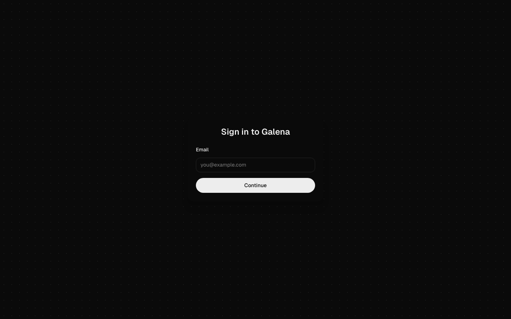

Your session stays signed in on that device. **Sign out** is in the menu (top-left) if you ever need it.

## Chats and groups

The left column lists every conversation: direct messages (DMs) with people, groups with several people, and chats with your AIs. The top tabs filter the list: **All**, **Personal**, **AIs**, **Work**. The search box finds chats by name, and ⌘K (Ctrl+K) jumps to it.

- **New chat** (the button at the bottom) starts a group, a DM (by inviting a friend), a new AI, or a new topic.
- **Invite a friend** is also in the menu. Friends join with an invite link and a sign-in code, like you did.
- Inside a chat you can reply, react with emoji, edit or delete your own messages, and send images and files (paste, drag-and-drop, or the paperclip button). The phone view below shows a DM with a reply, an image, a file, and a deleted message.

On a phone the same list fills the screen; opening a chat slides it in, and the back arrow returns to the list.

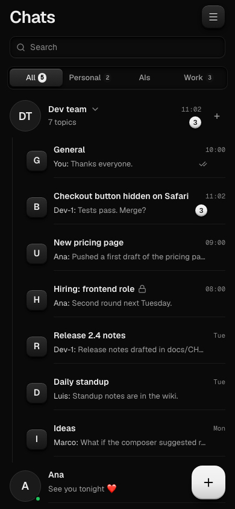

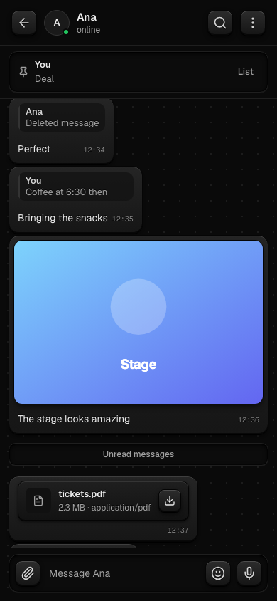

## Topics

Groups hold **topics**: one thread per subject, like a forum. The Dev team group in the picture has seven: General, a bug report, a pricing-page thread, hiring, release notes, standup, and ideas. Each topic is its own chat with its own history.

- The group row collapses to hide its topics, and shows the total unread count.
- Public topics are open to everyone in the group. Private topics (with a lock icon) are visible only to the people picked for them — not even group admins can see them.
- **General** is the first topic of every group and cannot be archived or made private.
- The **+** next to a group, or **New chat → New topic**, creates one: give it a name, a type (Topic, Task, Bug, UI, Routine), and choose Public or Private. For a private topic you pick the people (and which of your AIs may read it).

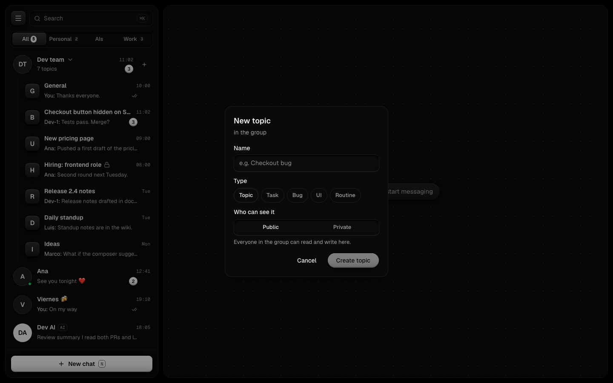

### The task strip

Every topic has a strip under its title: the type chip (BUG, TASK, UI…), the status (**Open**, **In progress**, **In review**, **Blocked**, **Done**), the owner (a person or an AI, or nobody yet), and an optional link (a PR, a page, anything on `https:`). Anyone who can see the topic can change these — click the status, the owner, or the link to edit.

On a phone the same strip sits under the topic title, above the messages.

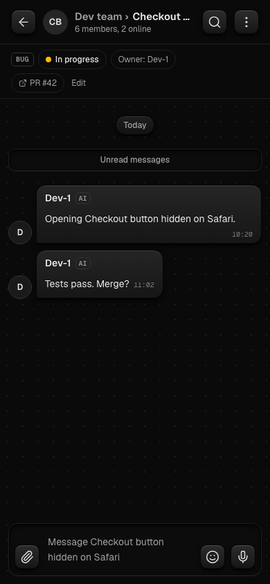

The topic panel (click the topic title) holds the full settings: rename, members, AIs, visibility, and archive.

## AIs: create, keys, caps, approvals, kill switch

An **AI** is an agent you own. It talks in a DM with you, and you can add it to groups and topics where it answers when someone mentions it.

- **Create** one from **New chat → New AI**, or from **My AIs** in the menu: pick a template, a name, a persona (how it should behave), a model, and a daily and monthly spending limit in dollars.
- **Keys**: Galena uses your own provider keys (OpenAI, Anthropic, …). Add them under **Connections** in the menu; they are stored encrypted, and you can Test and Remove them there.
- **Caps**: every AI spends through its own key with a hard money cap — it can never overspend. Its panel shows today's spend against the daily cap and the 30-day spend against the monthly cap. At 80% of either cap the AI posts a heads-up in the chat.
- **Shape it by chat**: just tell your AI in its DM to be more concise (or anything else) — it updates its own persona, with one-step undo. Only the owner can do this, only in the owner's DM.
- **Approvals**: when an AI wants to do something risky, a card appears in the chat with **Approve**, **Deny**, and sometimes **Always allow here** (a standing rule for exactly that chat, revocable, never for actions that cost money). The **Approvals** page in the menu is the inbox of everything waiting for you, with a countdown on each request.
- **Kill switch**: the AI's panel has **Stop AI**. It goes offline at once, any reply in flight is dropped, and nothing it was doing can land afterwards. **Resume** brings it back. The panel's Activity section records stops, resumes, and approval decisions.
- **Delete** (two-step, in the same panel) removes the AI and its chat; your provider connection stays.
- **Runs on**: each AI can be assigned to one of your machines (below), or to the platform when it has none.

A group with an AI looks like an ordinary group chat, except the AI answers when someone mentions it. The group panel lists the people, the AIs (with who added them), recent activity, and the standing "always allow" rules for that group.

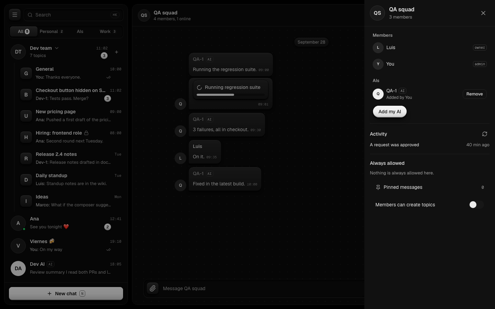

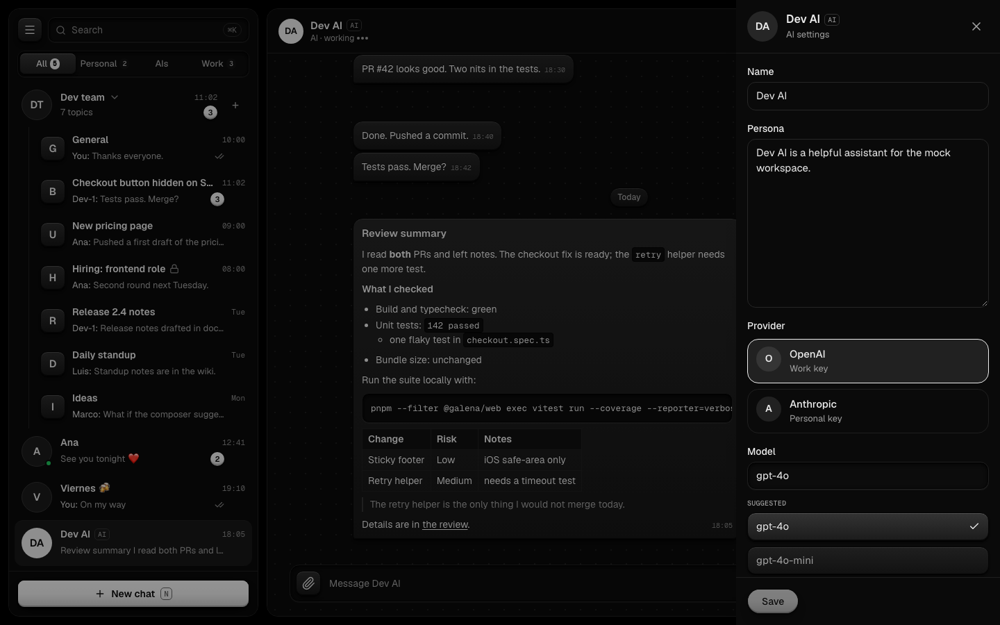

## Search

Type two or more letters in the search box: matching chat names appear first, then a **Messages** section with hits across your DMs, groups, and topics, grouped by chat with the match highlighted. Enter or a click opens that chat at the message. The magnifier in a chat header scopes the search to that chat only (a chip names it; click the chip to search everywhere again).

On a phone the same Messages section appears under the list while you type.

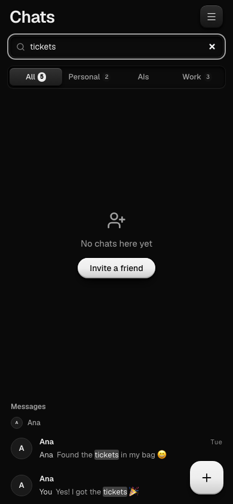

## Invite links

Every group has shareable **invite links**: a short web address that lets someone join that group directly, without you adding them one by one.

- **Create** one from the group's panel (click the group name, then Invite links): give it a label like "Design friends", and optionally an expiry (hours, up to a year) and a maximum number of uses.
- **Share** the link anywhere. Whoever opens it sees a preview of the group, signs in (or creates their account first), and joins.
- **Revoke** a link any time from the same list: the address stops working at once, while people who already joined stay.
- Only the group's owner or admins create, list and revoke links. Each link shows how many times it has been used, and whether it is expired or used up.
- On the phone the same three actions work: the group screen has an invite-links sheet (owner/admin only) with create (label up to 60 characters, expiry up to a year, up to 10,000 uses), the uses/state list, and revoke — plus a "Join with a link" form that opens a preview card with Join/Cancel. (The mock/demo join preview always reports you as already a member; the real join path is tested, not demoed.)

## Roles and private topics

Bigger groups can hand out **roles**: named badges like "Designers" or "Approvers", managed by the group's owner and admins from the group panel.

- A role has two powers: it can open **private topics** (below), and its holders can **approve AI requests** in the group's topics.
- Members see their own roles as chips next to their names. Adding or removing someone takes effect immediately.

**Private topics with roles.** A private topic can be opened to whole roles instead of named people: anyone holding the "Designers" role sees the topic, and someone who loses the role loses access at once. The rule from before still holds: a group owner or admin who is not in the private topic cannot see it.

- Making a private topic public shows its whole history to the group, so the app asks for an explicit confirmation first. Going public also removes the topic's roles.
- If a private topic ends up with nobody in it, it is archived automatically.

## Channels

A **channel** is a one-way feed inside a group: only the group's owner and admins can post, everyone else reads. Good for announcements, release notes, or a feed your AI posts into.

- Create one from **New chat → New channel**. It looks like an ordinary chat, except subscribers see a read-only bar instead of the composer, and the member list shows just the people who can post.
- Promoting or demoting an admin changes who can post immediately. The last admin cannot be demoted.
- Someone joins a channel the same way as a group: added by an admin, or through an invite link.

## Stickers (use, create, favorites)

**Use.** Open the sticker panel from the composer (the smiley button) and pick a pack, then a sticker: it sends as its own message. Stickers are small static pictures (PNG or WebP); an emoji in the chat usually stands in for the same picture.

**Create.** From the sticker panel choose **Create pack**, or open **Settings → Stickers** for the full manager: give it a name, add photos from your device, and save. Photos that are too big are shrunk; anything that is not a real picture is rejected.

**Share.** Every pack is either **Private** (only you see it) or **Shared**: a shared pack can be found by everyone on your Galena server and added to their own panel. Flip a pack between the two any time from Settings → Stickers (**Share** / **Make private**); other people still see only the packs they added, plus the stickers sent in chats.

**Favorites.** Long-press (or star) any sticker to add it to **Favorites**: your own cross-pack collection, always one tap away at the front of the panel. Unstar to remove.

- You can reorder the panel so your favorite packs come first.
- Your packs are yours: other people see only the stickers you send, not your whole collection.
- Everything above works on the phone app too, with the same panel in the chat.

## GIFs (and how the owner turns them on)

Next to stickers in the same panel there is a **GIFs** tab: search for a word ("applause", "facepalm") and send the clip. A sent GIF is stored by Galena itself, so watching it never contacts the GIF provider.

GIFs are **off until the server owner turns them on**: they need a provider key from Julio (`GIF_PROVIDER` plus `GIF_API_KEY` in the server's settings). Until then the GIFs tab says it is not available. Sending GIFs from the phone app is still being built.

## Notifications and installing the app

Galena can notify you of new messages even when the chat is closed, and it installs on your phone or desktop like a native app.

- **Notifications** live under **Settings → Notifications**: turn them on, and your browser asks once for permission. You can list your devices, remove ones you no longer use, choose whether message text shows in the notification, and send yourself a test.
- Notifications follow your mutes: a muted chat never buzzes, and opening a chat clears its notification.
- **Install the app**: on a phone use the browser's *Add to Home Screen* (on iPhone, Share → Add to Home Screen); on a desktop use the install button in the address bar. It opens full-screen with its own icon and works offline for the screens you already visited.
- Heads-up: notifications need a real `https` address to reach real devices, so they only work once Julio has deployed Galena publicly. On a local install the settings page explains what is missing.

## Search tips (prefix and typo tolerance)

The search box (top of the list, or ⌘K / Ctrl+K) finds messages across all your DMs, groups and topics — but only chats you are allowed to see. A few tricks:

- **Prefixes**: typing `hel` already finds "hello".
- **Typos**: `heello` still finds "hello", and accents don't matter (`cafe` finds "café").
- Type two or more letters; matching chat names come first, then a **Messages** section with the match highlighted. Enter opens the top hit.
- The magnifier in a chat header searches only that chat (a chip names it; click the chip to search everywhere again).
- On the phone, search has its own full screen with the same tricks, and opening a hit jumps straight to that message.

The search box never shows you anything from a private topic you are not in — those hits simply don't appear.

## Pins

Any message can be pinned. The banner under the chat title shows the newest pin (sender plus a line or two); with several pins it cycles ("1 of N"), and **List** opens every pin. Clicking a pin jumps to the message. Pin from the message's menu, unpin from the pins list. Up to 20 pins per chat. Pins work in DMs, groups, topics and channels, and the phone app shows the same banner and list.

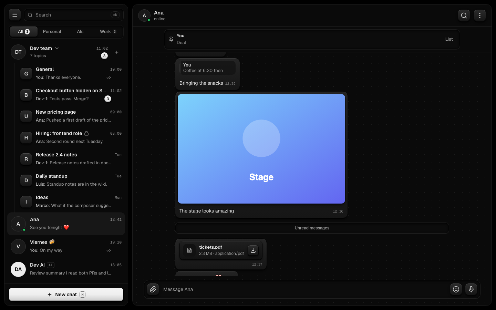

## Mute, archive, pin (chats)

Every chat row has a menu (hover, or the chat header's menu) with three per-user settings, synced across your devices:

- **Pin**: pins the chat to the top of your list (up to 20).
- **Mute**: silences notifications for 1 hour, 8 hours, 1 day, 1 week, or forever; muted chats still collect their unread count, shown grey.
- **Archive chat**: hides the chat behind an **Archived** row at the bottom of the list; unarchive from the same menu to bring it back.

Topics share the same menu; archiving a topic hides it inside its group's own Archived toggle instead. (A group manager can also archive a topic *for everyone* — but only topics they can see themselves, so a private topic they are not a member of is out of reach. Manager-archiving removes it for all members, not just you.)

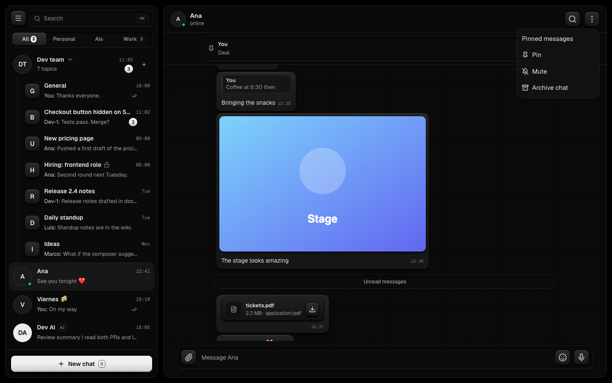

## Machines

**Machines** (in the menu) are computers you pair so your AIs can run on them: your Mac, a Linux box, a VPS.

1. Click **Add machine**: a pairing code appears, valid 10 minutes.
2. On the machine, install the runner app and pair it with the code. Check that the fingerprint the runner prints matches the one on the page.
3. **Approve** it on the page. Only approve a machine you just paired yourself.
4. The machine shows **Online** while its runner is connected. Assign an AI to it from the AI's panel (**Runs on**).
5. **Revoke** a machine you no longer trust: its runner is dropped at once, and its AIs fall back to the platform. Revoked machines stay listed until deleted (delete needs a revoke first).

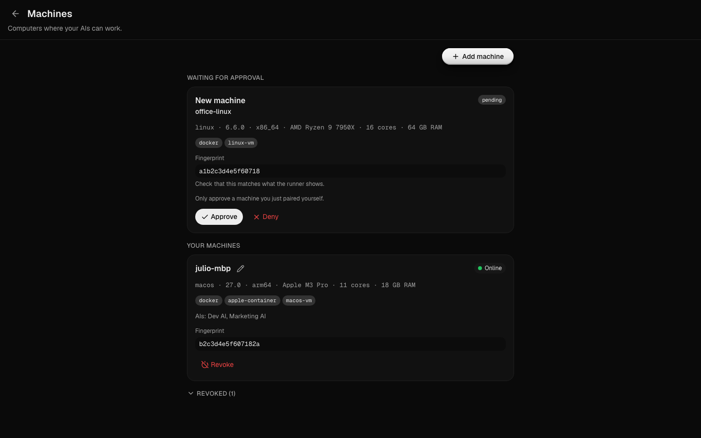

## Tools and routines (off by default, needs `TOOLS_ENABLED`)

An AI can write small **tools** (code that runs on a schedule or on demand) and **routines** (a tool plus a schedule that posts into the chat). Both are off by default: the server needs `TOOLS_ENABLED=true` (and `ROUTINES_ENABLED=true` for routines to fire).

- Open a topic's panel (click the topic title) and scroll to **Tools**: every tool shows its name, description, version, the sites it may contact (declared, and approved when shown), and its last run. The group's General panel and the AI settings panel show the same sections.
- Click a tool to see its read-only source, its version history (each version's message and hosts, with **Revert to this version** behind a confirm step), a **Run now** button with an optional JSON input, and its recent runs. **Delete tool** (confirm step) removes the tool and pauses its routines.
- The **Routines** list shows each routine's schedule in plain words (**daily at 09:00 Europe/Madrid**, **every 6 hours**), its next run, its last status, and — when paused — why: a routine paused because its tool contacts new sites, or after repeated failures, tells you to ask the AI to schedule it again. **Pause**, **Resume** and **Delete** (confirm step) are next to each row.
- Everything renders as plain text; long output is truncated with a **Show all** toggle.
- Plain members can look; only the AI's owner or a group owner/admin sees the Run, Revert, Pause, Resume and Delete buttons.

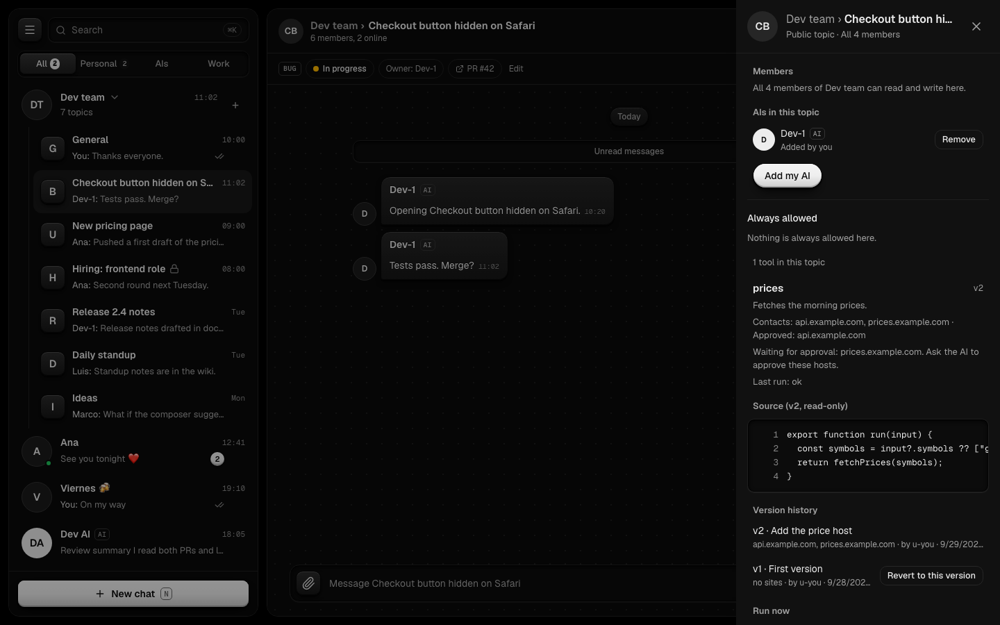

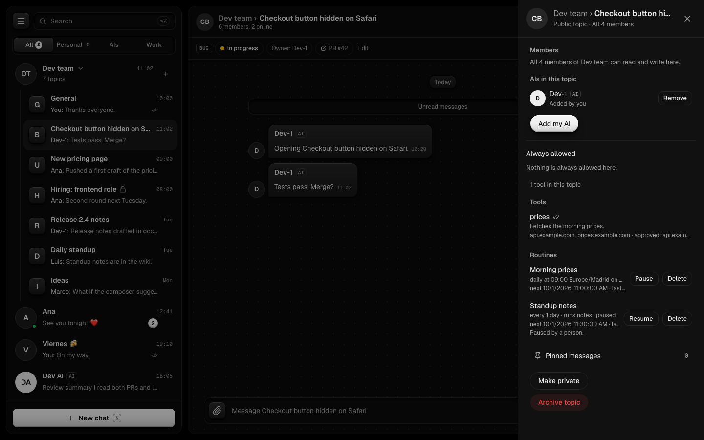

## Coming next

These are designed but not in the app yet:

- **(still needs devices)** Native push on iPhone through Apple's servers, and push in the production deploy — the web side is merged (T-0119; T-0118 was a spike only and was never merged), the deploy wiring is still planned (T-0145).
- **(needs Julio)** GIFs until he adds the provider key; Telegram sticker import until he creates the bot token.
- **(coming)** Voice messages.
- **(merged)** The install wizard, backups and the bare-metal guide: the owner's install helper (`deploy/galena`) covers `init`, `up`, `doctor`, `backup`, `restore` and `create-admin` (details in `docs/INSTALL_DOCKER.md`).
- **(coming)** GIFs on the phone: stickers already work there; the GIF tab is still planned (T-0148).
